# HackTUESX
Десетото юбилейно издание на емблематичния хакатон, от учиеници за ученици на ТУЕС 💓
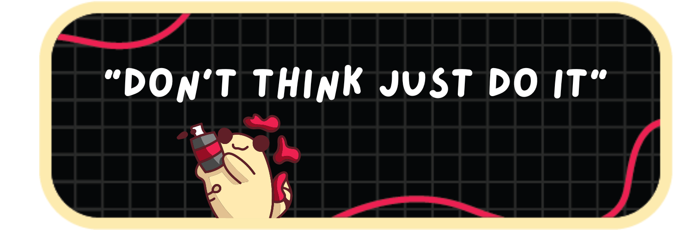

## Линк към презентация
https://docs.google.com/presentation/d/1BB1BeoStR4qal8qSW6mt_7psANaIRBVNeGXguayx46o/edit#slide=id.g2c33471906c_0_542

[Dreamer PPTX presentation](Dreamer_presentation.pptx)

[Dreamer PDF presentation](Dreamer_presentation.pdf)

## По коя тема работим?
Нашият екип избра да работи по втората тема на хакатона:
**Hack Your Hobby** 💤
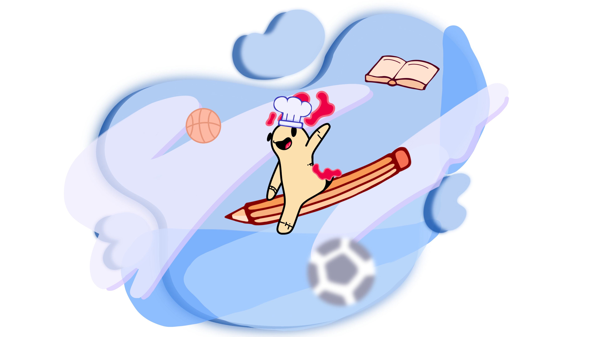

### Какво е нашето хоби?
Ще се запитате какво е нашето общо хоби сигурно. На пръв поглед ние нямаме такова! Всеки от екипа ни си има собствено уникано занимание, но четиримата заедн - не. 
Товага какво е хобито ни?
Истината е, че в престоя ни в ТУЕС има едно специфично нещо, което ние толкова желае, защото се е превърнало от ежеднение в крядкост, че е наше хоби!
И това е **сънят** 💤! 

## Какъв проблем решаваме?
Туесарите страдат от липса на пълноценен сън. Ежедневната нужда се е превърнала в блян, а и дори хоби.

## Нашите решения
Създаване на система, включваща две устройства, база данни и уеб сайт, които да следят и анализират съня на човек.

### 1. Устройство за следене на пулс
Това устройство събира информация за пулса на туесара по време на съня. В същината си това е един пусл сензор свързан към ESP32. 

Електрическа схема:

Тестване в реално време:

### 2. База данни MySQL
Получената информация за пулса се прехвърля към база данни за допълнителен анализ на качеството на съня на туесара

1. Query SHOW TABLES;

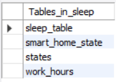

В базата данни има четири таблици, както е показано на фигурата отгоре. 

Първата таблица **sleep_table** събира измерените стойностти от сензора за пулс. Данните се изпразат към MQTT broker.

Втората таблица с името **smart_home_state** отговаря за изпразането на заявки към MQTT broker, които се свърза с управлението на устройствата в дома на човека.

Третата таблица в настоящата серсия на прокета е неизползваема.

Последната таблица **work_hours** се свръзва с работния график на човека, в какви диапазони от време той не трябва да спи. Работния график на човека се задава от уеб сайта ни.

2. Query SELECT * FROM sleep_table;

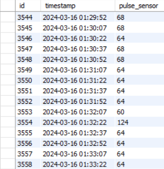

С тази зявка могат да се видят събраните данни от пулс сензора. В записите може да се види, че човека е в състояние на лек съм, когато пулсът му варира между 50-60bmp и 70bmp. Това е състояние на унасяне, от което човек може лесно да бъде събуден. Следващият стадии е дълбокия сън. Във фазата на дълбокия сън сърдечният ритъм се забавя още повече. Той може да спадне до около 40-50bmp или дори по-ниско.Тези данни са извадени от онлайн проучване. На базата на това проучване за нашия проект беше написан **алгоритъм** за тази цел.

3. Query SELECT * FROM smart_home_state;

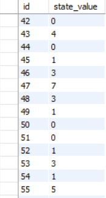

Тази заявка пълни базата данни с определено **state_value**, което е предопределено на базата на устройствата в къщата. В нашия случай се използва лампа, телевизор и шори. 

    case 0: status = "all off"; break; 
    case 2: status = "lamp on"; break;
    case 1: status = "tv on"; break;
    case 4: status = "blinds on"; break;
    case 3: status = "lamp and tv on"; break;
    case 6: status = "lamp and blinds on"; break;
    case 5: status = "tv and blinds on"; break;
    case 7: status = "all on"; break;
    default: status = "unknown"; break;

4. Query SELECT * FROM work_hours;

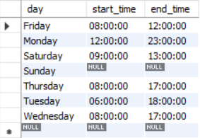

В тази заяка се показва кога определения индивид е на работа и нъответно къщатата му не трябва да бъде подготвяна за сън. Таблицата се актуализира от уеб сайта.

### 3. Устройство за подготовка на дома
Ако се отбележи, че туесарът спи непълноценно, това устройство активира подготовка в дома, като например регулиране на осветлението или температурата, за да се подобри качеството на съня.

Електрическа схема:
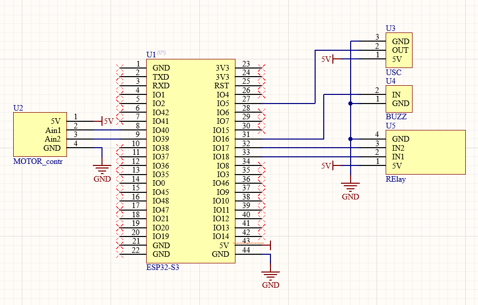

Тестване в релано време:

### 4. Уеб сайт
Позволява на потребителите да проследяват сънните им показатели и да управляват устройствата в своя дом за оптимално сънно околие.

1. Index page
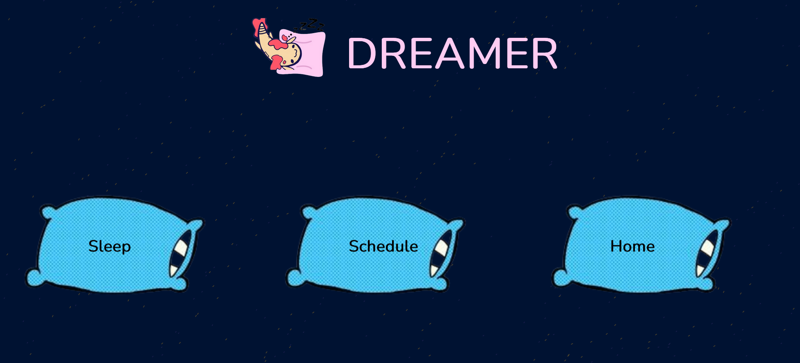

Състои се от три бутона, като първия **Sleep** отива до статискита за съня на човека. Вторият бутон **Schedule** позволява настройването на работен график, докато последния бутон **Home** е предвиден за отдалечен достъп до устройствата в къщата.

2. Sleep page
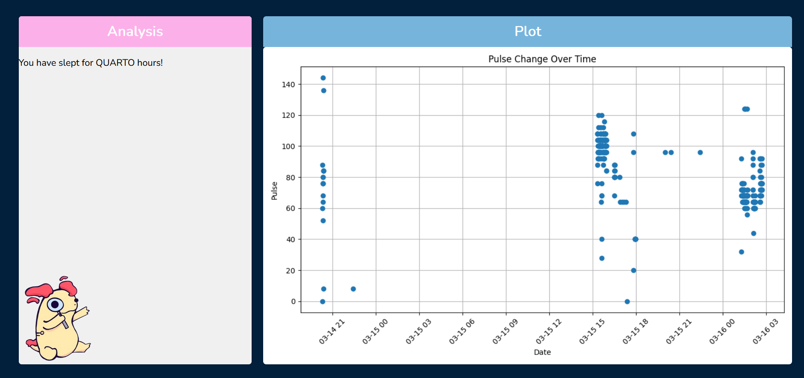

Изважда статистика за съня на човека и неговата пълноценност. В бъдеща реализация на проекта е предвидено и препоръки към потребителя.

3. Shedule page
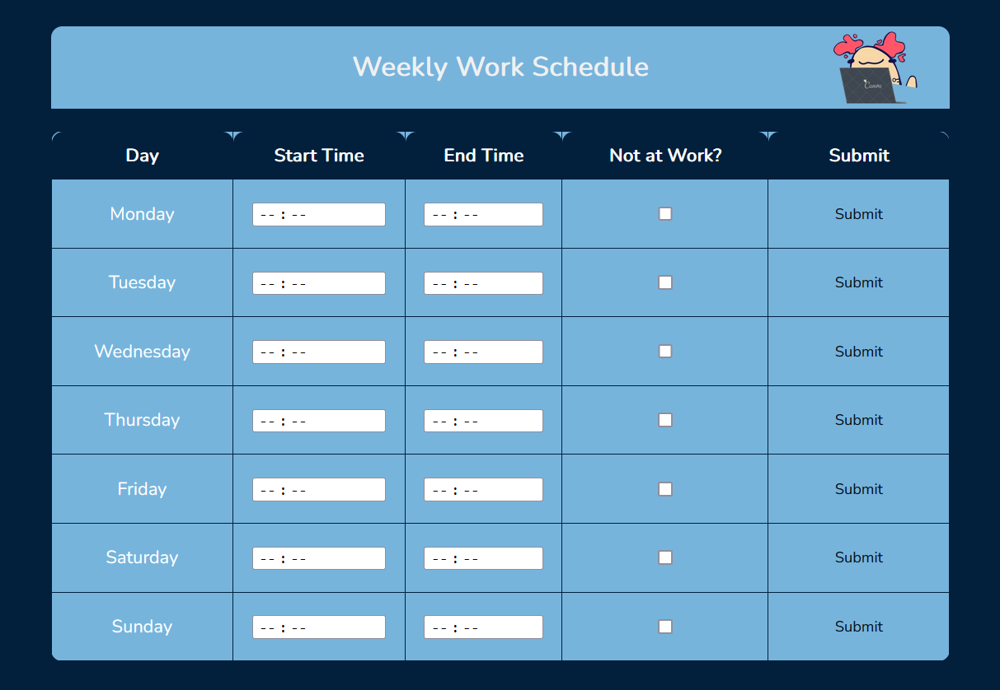

Възможност потребитя да си настой часовете, в които е на работа и не е редно да спи.

4. Home page
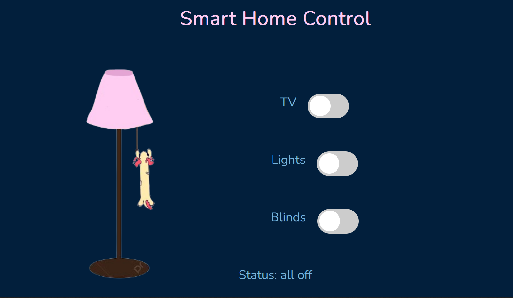

Състои се от три бутона. Идеята е да се контролират отдалечено различни устройства в къщата на човека. Ние сме имплементирали включването и изключването на лампа, телевизор и спускането и вдигането на щори. Под бутоните се изписва и статуса.

## Комуникационна схема
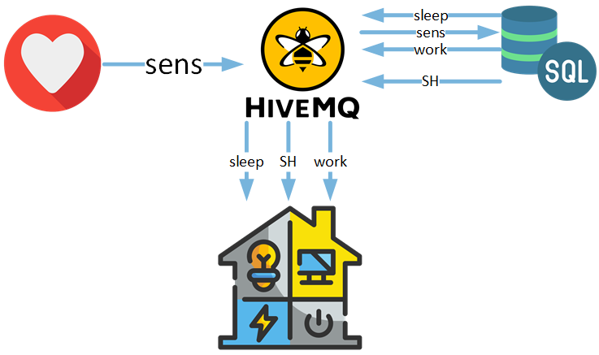

## Използвани технологии

